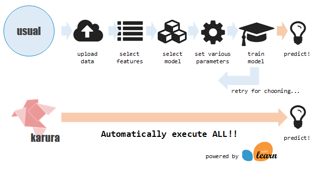
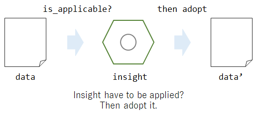
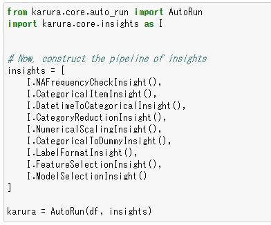
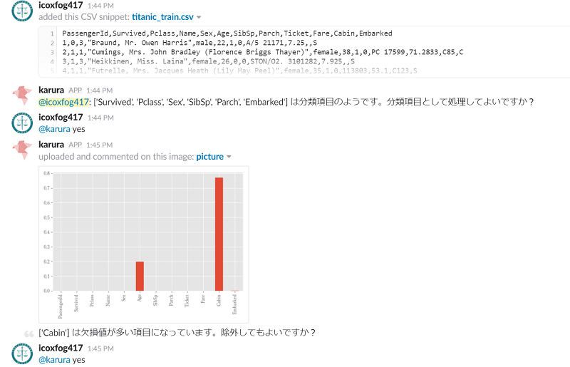
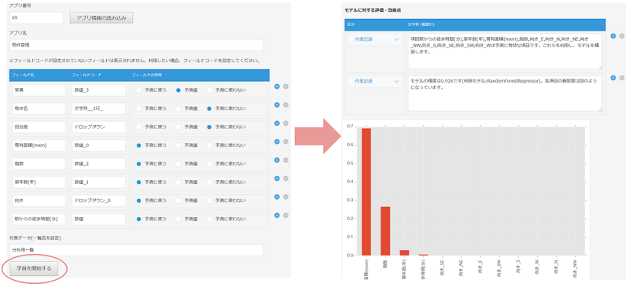

# karura

karura enables you to use machine learning automatically & interactively.

## Architecture

karura has insights. 

Each insight gets the data and judges the necessity of its adoption, and if it needed, execute it.

For example, [`NAFrequencyCheckInsight`](https://github.com/chakki-works/karura/blob/master/karura/core/insights/na_frequency_insight.py) watches the amount of the `NA` in each column, and if it is too high, then drop the column. Of course, you can confirm it to the user.

karura can have many insights, so you can add the insight as you needed. 

Insights are adopted according to the [InsightIndex](https://github.com/chakki-works/karura/blob/master/karura/core/insight.py#L61) order.  
And you can create custom insight by inheriting the [`Insight`](https://github.com/chakki-works/karura/blob/master/karura/core/insight.py) class.

**karura is multi-language application. Now supports `ja` and `en`.**  
(Some message on kintone is only Japanese).

## Usage

### In the Jupyter Notebook

You can use karura as your partner for data analytics.

[karura notebook](https://github.com/chakki-works/karura/blob/master/doc/karura_notebook_demo.ipynb)

### As Slackbot

You can communicate with karura on [Slack](https://slack.com/)!

When you upload the csv file or tell kintone app name to karura, then interaction starts.You can build your own machine learning model interactively, and also you can get some suggestions about the data treatment from karura.

### As Adviser on kintone

You can ask karura to analyze your kintone app!

* Select the target app
* Select the field that you want to predict and fields that you use to do it
* Push Train button

Then, you can get analyzed result!

## Setup

### Slackbot

* Use Dockerfile_slackbot
* set below environmental variables
  * SLACK_TOKEN: Your Slack token
  * LANG: language that you want to use (`ja` or `en`)

### kintone

**[Tutorial is available (ja)](http://qiita.com/icoxfog417/private/ba6cc8c804f09fd2b16e)**
