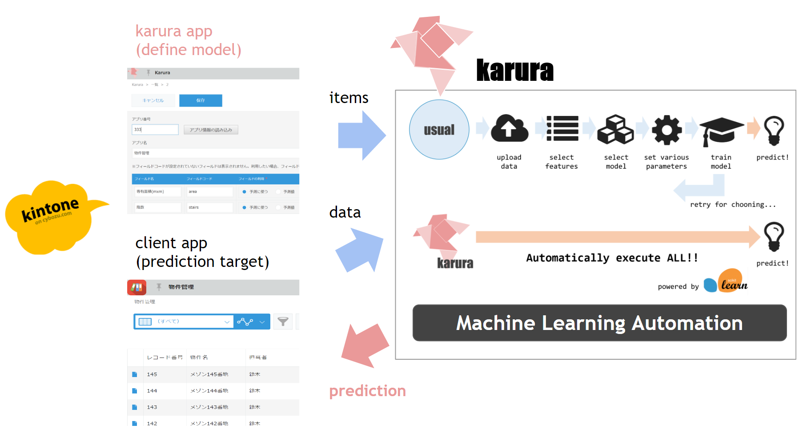

# karura

karura enables you to use machine learning interactively.

# Usage

## As Adviser on kintone

You can ask karura to analyze your kintone app!

* Select the target app
* Select the field that you want to predict and fields that you use to do it
* Push Train button

Then, you can get analyzed result!

## As Slackbot

You can communicate with karura on [Slack](https://slack.com/)!

When you upload the csv file or tell kintone app name to karura, then interaction starts.You can build your own machine learning model interactively, and also you can get some suggestions about the data treatment from karura.

# Architecture

karura automate the fundamental process of machine learning.

* To propose the important factors for prediction, karura does not use Neural Network
* You can use karura whenever you want, especially the phase that amounts of the data is not enough
* **If amount of the data is enough, and karura tells you that the target is predictable, it is the timing that you have to use more powerful BI or machine learning platform**

So, karura is the supporter to store the useful data for human and machine learning by enabling you everytime-easy-lightweight-prediction.

# Setup

## Slackbot

* Use Dockerfile_slackbot
* set below environmental variables
  * SLACK_TOKEN: Your Slack token
  * LANG: language that you want to use (`ja` or `en`)

## with kintone

* Prepare the kintone account
* Push the following Heroku Button and setup the kerura server
* Make Karura app on your kintone (comming soon!)
* Change Karura server url on JavaScript customize (comming soon!)

